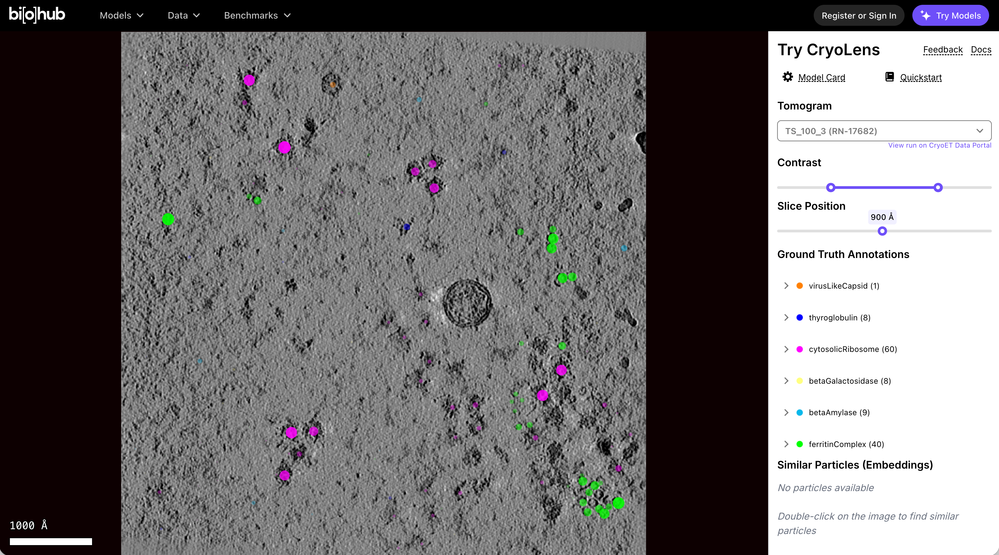
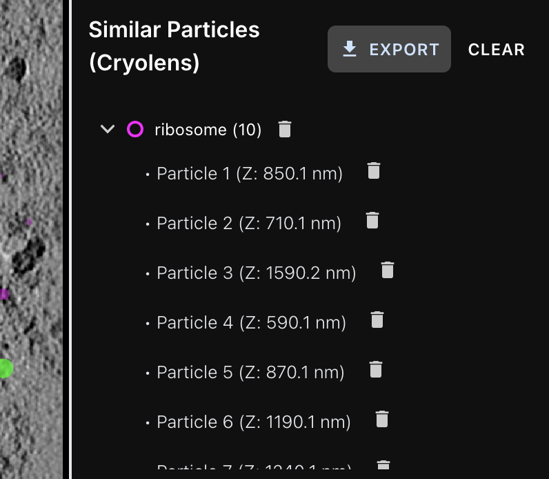

# Try CryoLens Documentation

Try CryoLens is a demo webapp that allows you to explore **precomputed inference results** from CryoLens on a subset of tomograms from the model evaluation data hosted on the [CryoET Data Portal](https://cryoetdataportal.czscience.com). This demo supports interactive visualization of particle annotations and similarity search powered by fused embeddings.

> **Note**: CryoLens details and quickstart notebooks can be found on the [CryoLens model page on the Virtual Cell Platform](https://virtualcellmodels.cziscience.com/model/cryolens).

Try CryoLens has been tested on **Google Chrome** and may not behave consistently on other browsers.

## Interface Overview

Try CryoLens has two main areas:
- An **image canvas** (left) showing the tomogram and ground truth annotations with a scale bar in **Angstroms**.
- A **control panel** and **list of particles**(right).

### Tomogram Visualization

- Choose a tomogram from the dropdown list at the top. Each option corresponds to a **run within a dataset** on the CryoET Data Portal. [Learn more about CryoET data organization and terminology here](https://chanzuckerberg.github.io/cryoet-data-portal/stable/cryoet_data_portal_docsite_data.html#data-organization).
- Below the selector, the link **“View run on the CryoET Data Portal”** opens the specific run page on the CryoET Data Portal in a new tab.
- Try CryoLens initially loads a low-resolution tomogram for faster performance; higher-resolution tiles load as you zoom in.
- Adjust the visibility of the tomogram using the Contrast range slider, as the default contrast is not pre-optimized.
- Use the Slice Position slider to scroll through slices of the 3D volume with units in **Angstroms**.
- You can **zoom** using scroll or two-finger gestures (on Mac).
- **Pan** by clicking and dragging the image.

### Ground Truth Annotations

Below the visualization controls is a list of all particles with ground truth annotations in the current tomogram.

For each particle type:
- A **solid-colored circle** marker is shown in the canvas.
- A label shows the particle name and number of instances (e.g., `cytosolicRibosome (24)`).
- You can expand each list to see Z positions for each instance.
- Clicking a particle in the expanded list updates the canvas to center that particle in 3D space.

### Find Similar Particles

When you double-click anywhere in the tomogram, Try CryoLens selects the **nearest labelled particle** and retrieves a list of **similar particles** across the full tomogram based on the similarity of their embeddings. This list is shown in the Similar Particles (Embeddings) widget.

Details:
- The selected particle will be shown as an **open circle**. This open circle will almost completely overlap with a solid circle, since it corresponds to one of the ground truth particles that are already labelled.  
- Similar particles are found using **fused embeddings** combining CryoLens and [TomoTwin](https://tomotwin-cryoet.readthedocs.io/en/stable/) features.
- Each result is marked with an **open circle** colored according to the particle type.
- The results are grouped by query and listed in collapsible accordions.
- Each list includes:
  - Individual particles Z positions.
  - Trash icons to delete individual particles or full lists.
- At the top of the widget, the `CLEAR` button deletes all lists and the `EXPORT` button downloads them as an `.ndjson` file.

### Fused Embeddings

Fused embeddings combine TomoTwin and CryoLens features using attention-based fusion, which works as follows:

 - Inputs: TomoTwin embeddings (32D) + CryoLens structural embeddings (32D).
 - Attention mechanism: Neural network learns importance weights for each embedding source.
 - Fusion: Weighted embeddings are concatenated and processed through a 3-layer Multi-Layer Perceptron (MLP). (128→64→32D)
 - Training: Supervised with classification labels to optimize feature combination.

This mechanism was designed to be comparable to both sets of original embeddings, so it outputs a 32D embedding per particle. The benefit of this method is that it emphasizes whichever embedding is more informative. Extra steps were taken to ensure fusion trained inside each cross validation (CV) fold when evaluating performance.

The result is a single 32D embedding that has been optimized to combine the strengths of TomoTwin, which has been optimized for classification, and CryoLens, which has been optimized for 3D reconstruction for improved classification performance.

## Exporting Picks

Click the **`EXPORT`** button to download all particle sets selected during your session.

- Exported file format: `.ndjson`.
- The exported file includes all lists of similar particles.
- This file can be loaded in either:
-- the [example quickstart](https://virtualcellmodels.cziscience.com/quickstart/cryolens-quickstart), or
-- [napari](https://napari.org/stable/) using the [CryoLens plugin](https://github.com/czi-ai/napari-cryolens).

## Share Your Feedback

We welcome your feedback!

- Click the **“Give Feedback”** link in the demo app (top right panel).
- Or submit through [this form]([#](https://airtable.com/app78IB3m6DJSxkMO/pagUurVUUyh2Auwsc/form?hide_user_id=true&hide_amplitude_id=true&hide_device_id=true&hide_page_id=true&prefill_event=docs1&hide_event=true) 
