# CryoLens MLC Dataset Visualization

This document provides an overview of the CryoLens MLC dataset through various visualizations. These visualizations help in understanding the dataset's composition, structure distributions, and quality variations across different SNR levels.

## Dataset Structure Distribution

The distribution of structures in the dataset shows the relative frequency of each molecule type, including background samples:

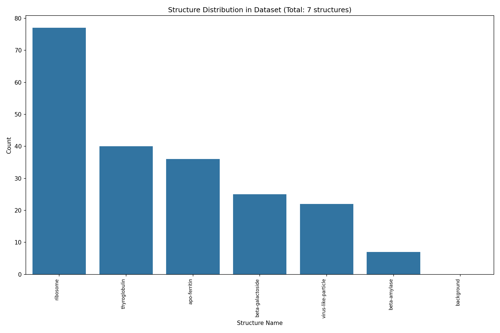

## Sample Structures

Sample views of various structures from the dataset with projections along the XY, XZ, and YZ axes:

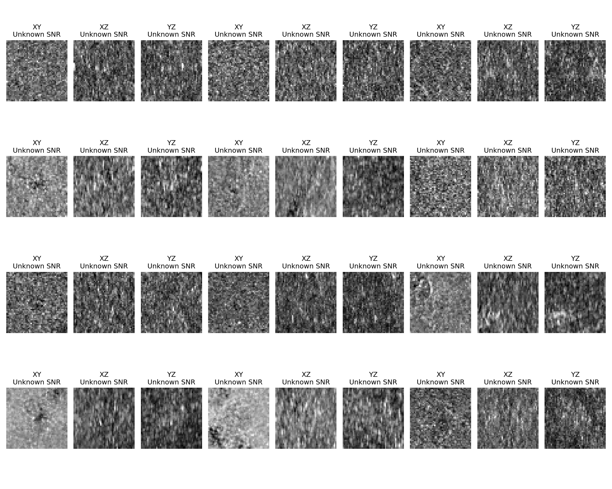

## Density Distribution

The distribution of density values across structures in the dataset:

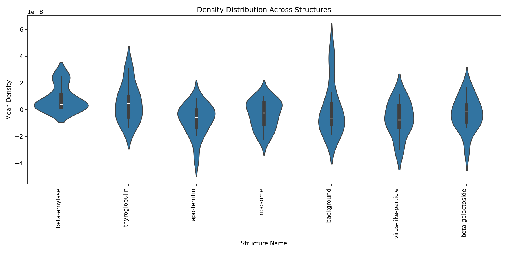

## SNR Comparison

Comparison of the same structure across different Signal-to-Noise Ratio (SNR) levels:


## Structure Comparison at Different SNR Levels

### High SNR

Comparison of different structures at high SNR levels:


### Low SNR

Comparison of the same structures at low SNR levels:


## Source Type Distribution

Distribution of source types in the dataset:

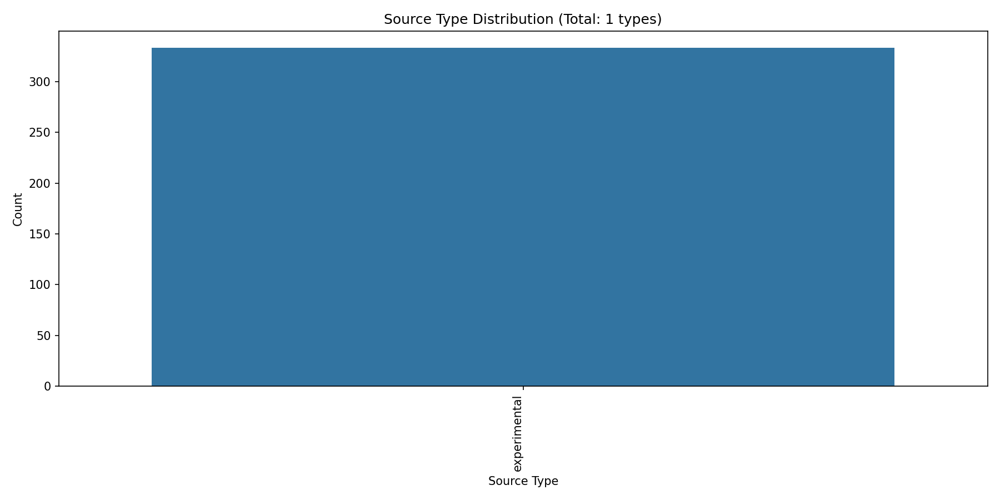

## Curriculum Weights

Distribution of weights in the curriculum specification (if available):


## Individual Molecule Projections

The following sections display three examples of each molecule type with sum projections along each axis.

### Apo-Ferritin

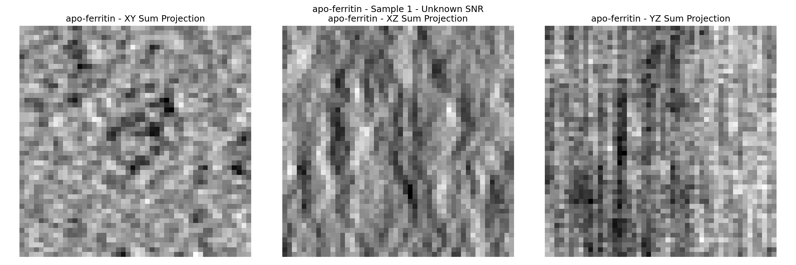
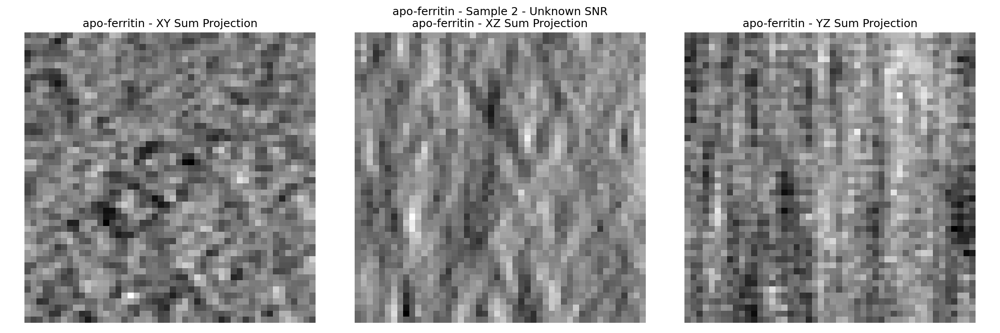
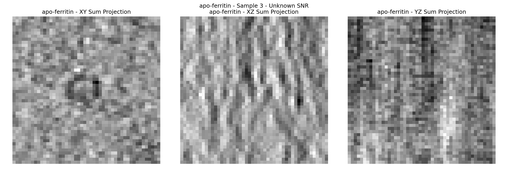

### Beta-Amylase

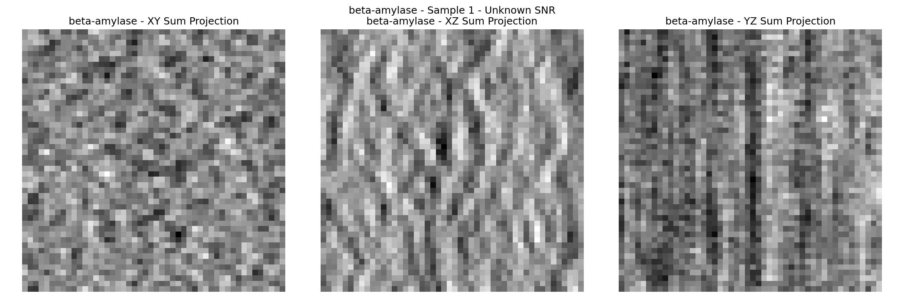
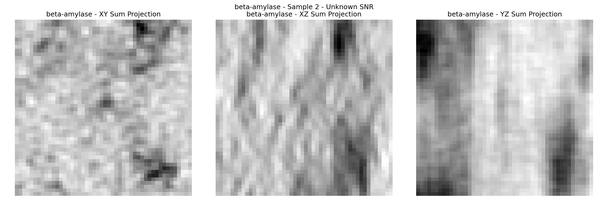
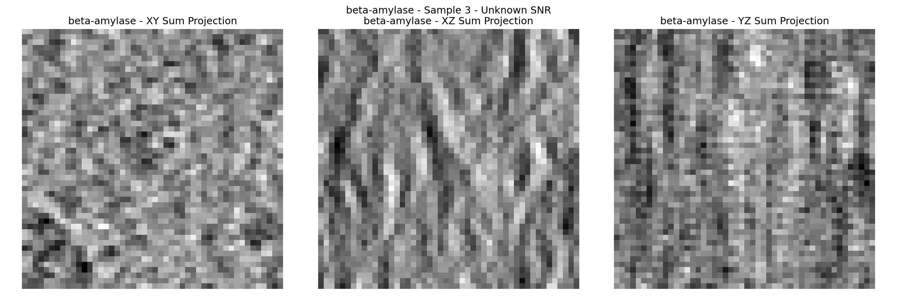

### Beta-Galactoside

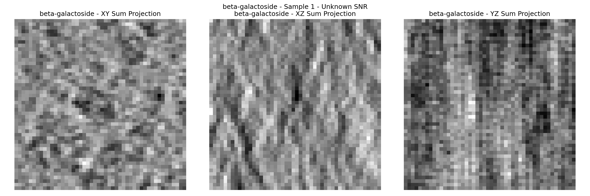
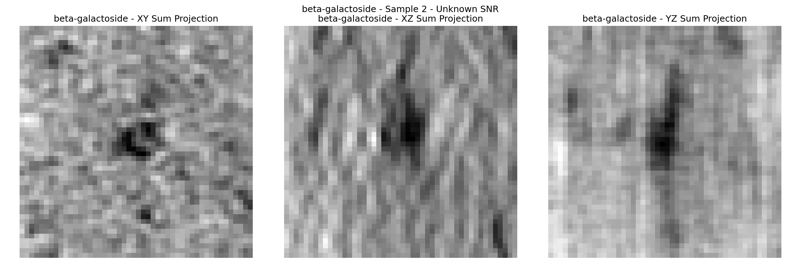
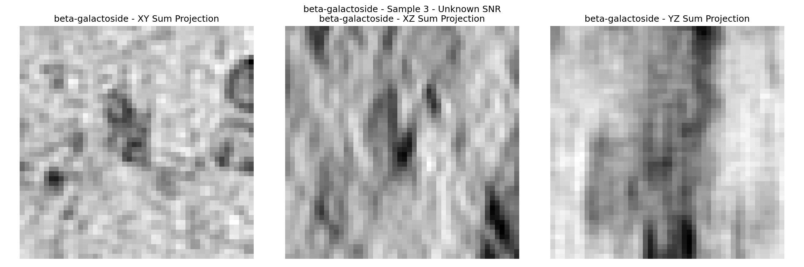

### Ribosome

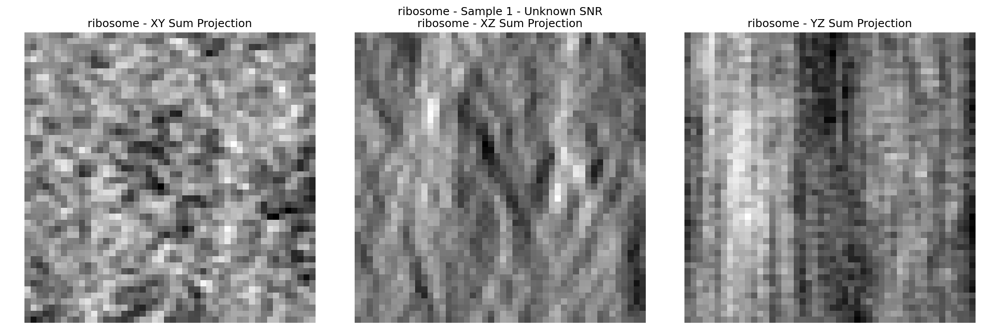
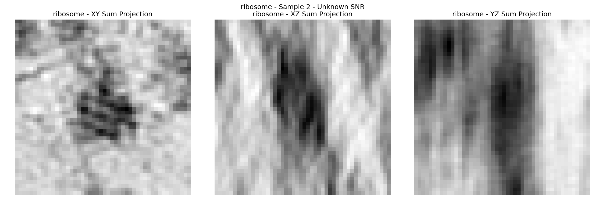
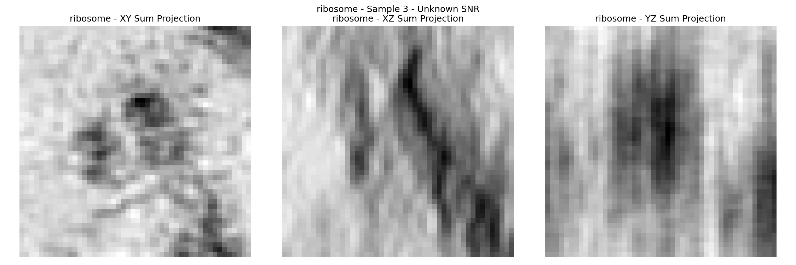

### Thyroglobulin

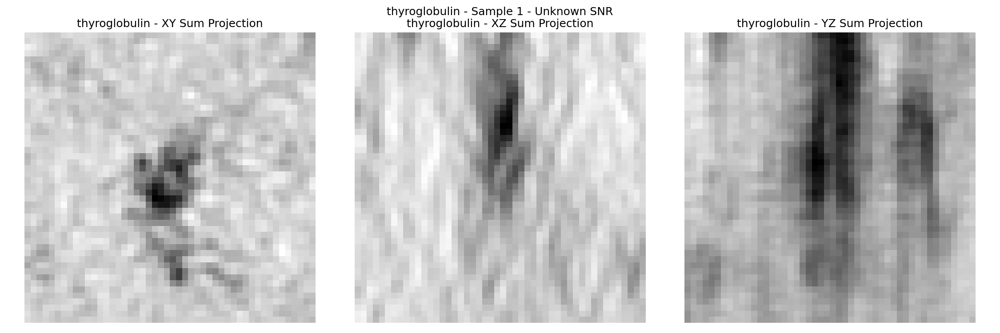
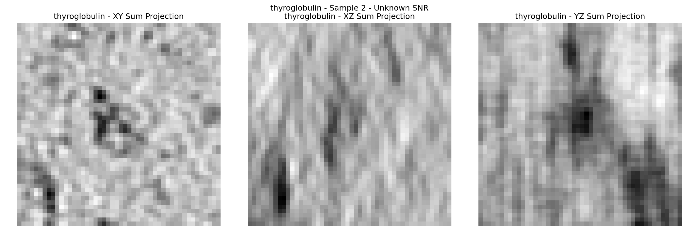
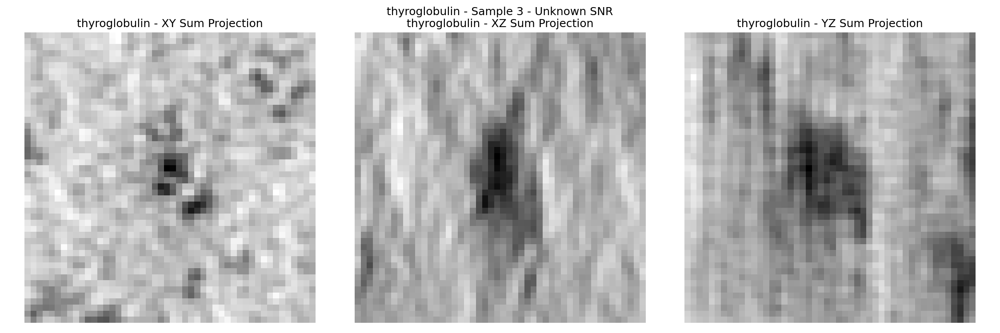

### Virus-Like-Particle

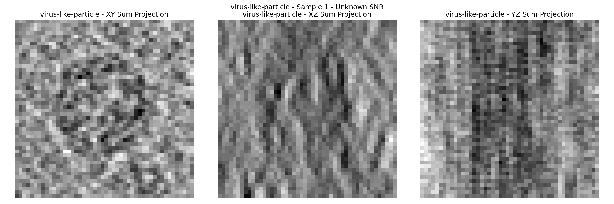
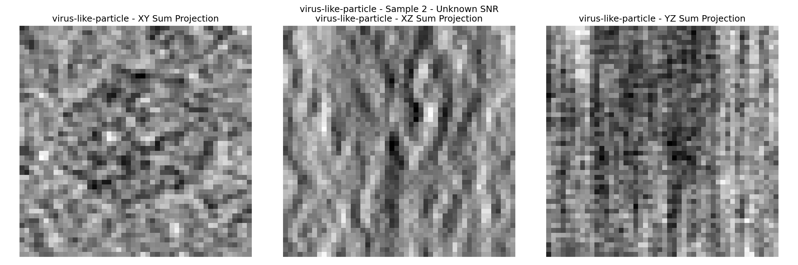
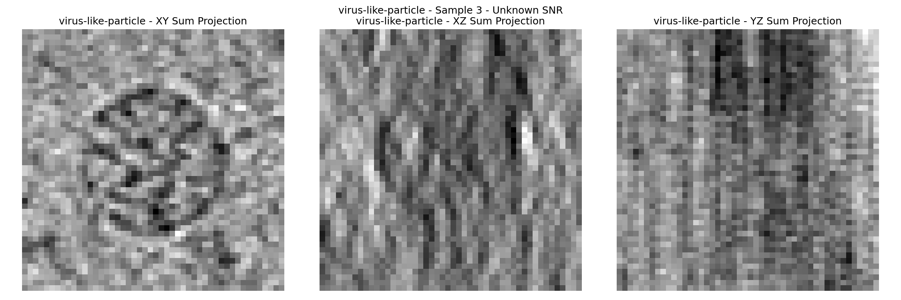

### Background


## Regenerate images

```
uv run src/cryolens/docs/viz_dataset.py --parquet_path ./dataset_20250322_051824.parquet --copick_config ./ml_challenge.json --curriculum_path ./curriculum.json --output_dir ./docs --normalization z-score
```