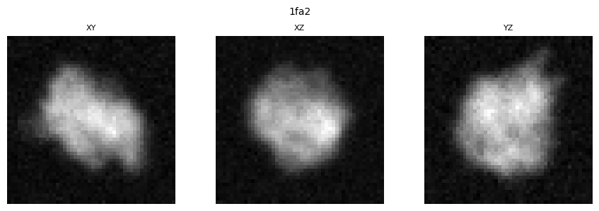
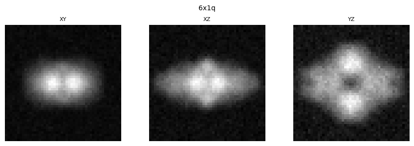
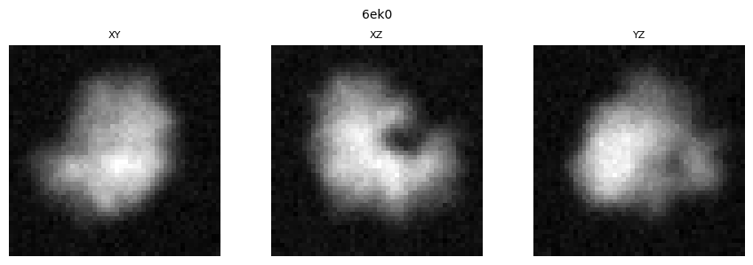
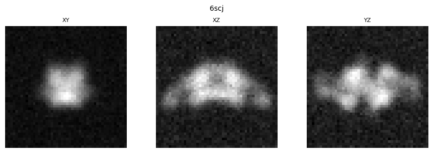
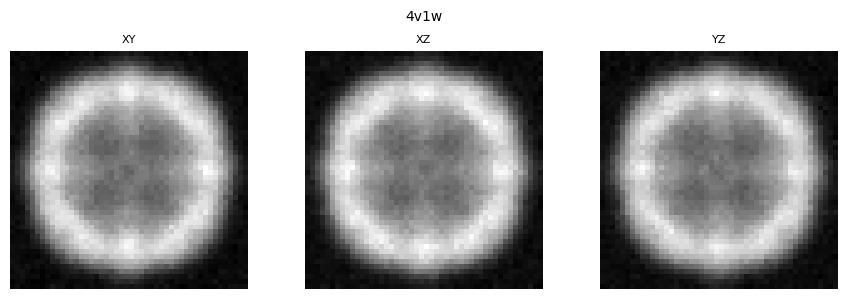
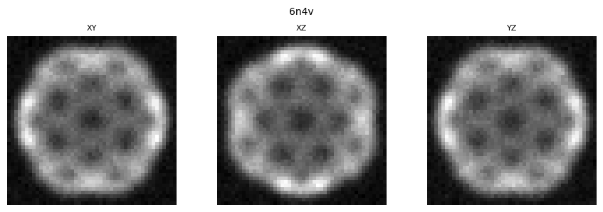

# Similarity Pairs Visualization

Total pairs: 21

| Structure A | Structure B | Similarity Score |
|-------------|-------------|------------------|
|  |  | 1.0000 |
|  |  | 0.9560 |
|  |  | 0.9056 |
|  |  | 0.9056 |
|  |  | 0.9049 |
|  |  | 0.9009 |
|  |  | 0.8819 |
|  |  | 0.8819 |
|  |  | 0.8763 |
|  |  | 0.8631 |
|  |  | 0.8631 |
|  |  | 0.6257 |
|  |  | 0.6257 |
|  |  | 0.5962 |
|  |  | 0.5807 |
|  |  | 0.5641 |
|  |  | 0.5586 |
|  |  | 0.5255 |
|  |  | 0.5255 |
|  |  | 0.4982 |
|  |  | 0.4914 |

## Statistics

- **Total pairs visualized**: 21
- **Affinity range**: 0.4914 to 1.0000
- **Mean affinity**: 0.7396 ± 0.1772
