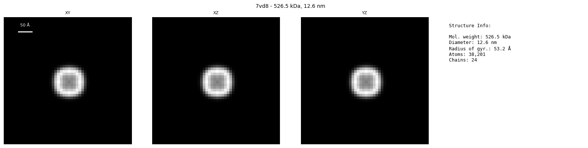
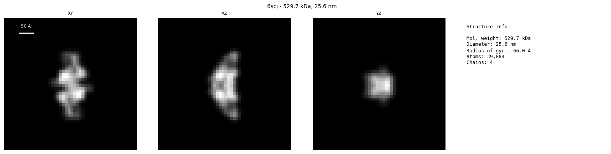
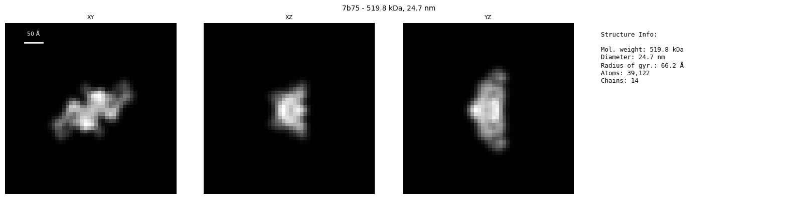
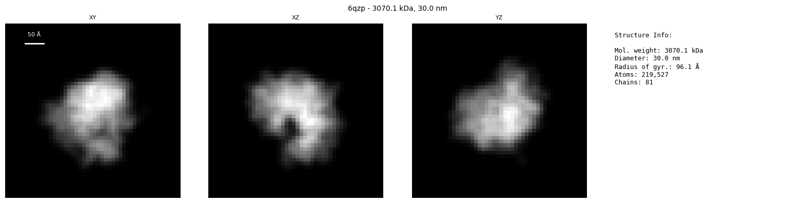
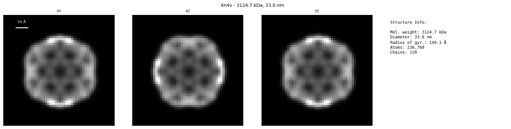

# Similarity Pairs Visualization

Total pairs: 36
Box size: 48³ voxels
Voxel size: 10.0 Å/voxel
Physical box size: 480.0 ų
Target resolution: 15.0 Å

| Structure A | Structure B | Similarity Score |
|-------------|-------------|------------------|
|  |  | 1.0000 |
|  |  | 1.0000 |
|  |  | 0.9745 |
|  |  | 0.9744 |
|  |  | 0.9743 |
|  |  | 0.9742 |
|  |  | 0.9629 |
|  |  | 0.9628 |
|  |  | 0.9506 |
|  |  | 0.9487 |
|  |  | 0.9426 |
|  |  | 0.9417 |
|  |  | 0.9347 |
|  |  | 0.9345 |
|  |  | 0.9221 |
|  |  | 0.9209 |
|  |  | 0.9011 |
|  |  | 0.9008 |
|  |  | 0.8874 |
|  |  | 0.8850 |
|  |  | 0.8844 |
|  |  | 0.8826 |
|  |  | 0.8406 |
|  |  | 0.8405 |
|  |  | 0.8398 |
|  |  | 0.8373 |
|  |  | 0.8357 |
|  |  | 0.7481 |
|  |  | 0.3392 |
|  |  | 0.0980 |
|  |  | 0.0785 |
|  |  | 0.0234 |
|  |  | 0.0198 |
|  |  | 0.0063 |
|  |  | 0.0063 |
|  |  | 0.0046 |

## Statistics

- **Total pairs visualized**: 36
- **Affinity range**: 0.0046 to 1.0000
- **Mean affinity**: 0.7272 ± 0.3576
